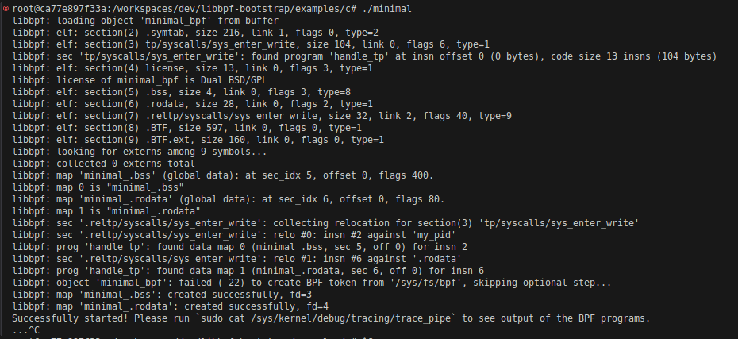
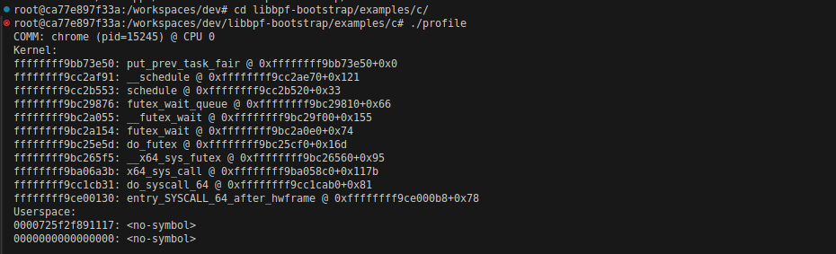
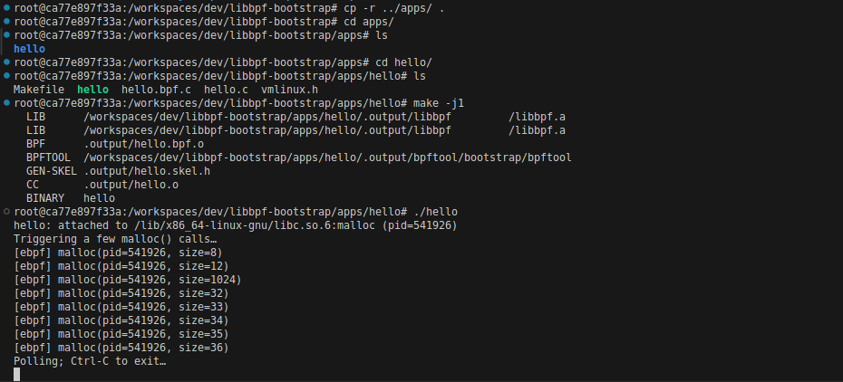
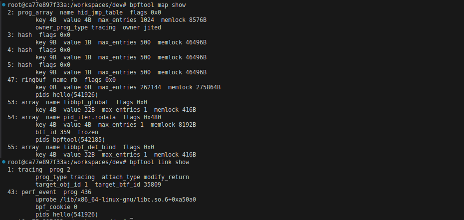
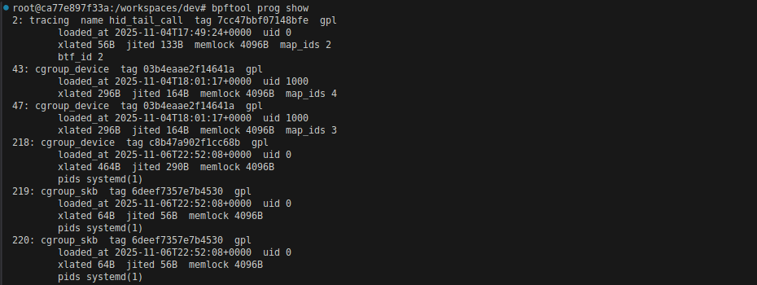

# eBPF DevContainer — Ubuntu 22.04 + libbpf-bootstrap + Custom App Example

## Table of Contents

1. [eBPF DevContainer — Ubuntu 22.04 + libbpf-bootstrap + Custom App Example](#ebpf-devcontainer--ubuntu-2204--libbpf-bootstrap--custom-app-example)  
2. [Why I Moved from BCC to libbpf](#why-i-moved-from-bcc-to-libbpf)  
3. [Container Overview](#container-overview)  
4. [How the container is configured](#how-the-container-is-configured)  
5. [Build dependencies and bootstrap setup](#build-dependencies-and-bootstrap-setup)  
6. [Getting started](#getting-started)  
7. [Smoke Tests — Verifying the Environment](#smoke-tests--verifying-the-environment)  
   - [Test 1 — minimal](#test-1--minimal)  
   - [Test 2 — profile](#test-2--profile)  
8. [Practical Sample — apps/hello (Custom uprobe Example)](#practical-sample--appshello-custom-uprobe-example)  
   - [Step 1 — Understanding the code](#step-1--understanding-the-code)  
   - [Step 2 — About vmlinuxh](#step-2--about-vmlinuxh)  
   - [Step 3 — Building our first app](#step-3--building-our-first-app)  
   - [Step 4 — Running it](#step-4--running-it)  
9. [bpftool: The microscope for the eBPF world](#bpftool-the-microscope-for-the-ebpf-world)

---

I created this repository as a **personal, reproducible development environment** for exploring **eBPF and libbpf**. It's easy to forget setup details over time, especially with busy schedules, so this serves as a clear roadmap for future reference.

I often worry that installing new tools or modifying my setup might cause issues, which is why I prefer using **Docker containers**. They provide a safe, isolated space for experimentation, keeping my main workflow intact.

This project represents a consistent environment where everything works reliably upon returning to it. I also want to thank the open-source community for their valuable contributions that have helped me on this journey. This repository aims to give back and assist others new to eBPF.

For validation, I used the `minimal` and `profile` examples from `libbpf-bootstrap` and added a **custom example** (`apps/hello`) that shows how to build and run a user-space uprobe with a ring buffer.

## Why I Moved from BCC to libbpf

I started my eBPF experiments with BCC (BPF Compiler Collection) due to its simplicity and solid documentation. However, I found that libbpf is a more robust solution, especially for embedded Linux and Yocto-based systems.
 
**Key Advantages of libbpf:**
 
- **No Runtime Dependencies:** Unlike BCC, which requires Python and LLVM, libbpf generates small, standalone C binaries for minimal embedded systems.
- **Kernel Integration:** libbpf is maintained in the kernel tree, ensuring stability and compatibility with kernel updates.
- **Compile Once — Run Everywhere (CO-RE):** Build once on our development machine and run on different kernels without recompiling.
- **Performance and Security:** Faster loading without runtime clang compilation, ideal for read-only or hardened environments.
- **Production Friendly:** Supports signed, prebuilt binaries with predictable behavior, aligning with the needs of automotive and industrial systems.
- **Modern Tooling:** Tools like bpftool and systemd leverage libbpf, making it the go-to for the ecosystem.
 
In summary, BCC is great for learning and prototyping, while libbpf excels in deployment, portability, and maintainability.
---

## Container Overview

The **DevContainer** provides a complete Ubuntu 22.04 environment for eBPF development using **clang, llvm, bpftool, and libbpf-bootstrap**.

It supports:

- Building and running eBPF programs via libbpf and bpftool

- Accessing host kernel BTF, tracefs, and bpffs

- Symbolization via **blazesym** (`BLAZESYM_ROOT=/host`)

- Testing tracepoints, uprobes, and ring buffers

- Running our own apps inside `/dev/apps`
---

## How the container is configured

`devcontainer.json` runs an Ubuntu 22.04 container with the following privileges:
```json
"runArgs": [
  "--pid=host",
  "--privileged",
  "--cap-add=BPF",
  "--cap-add=PERFMON",
  "--cap-add=NET_ADMIN",
  "--cap-add=SYS_ADMIN",
  "--security-opt=seccomp=unconfined",
  "--ulimit", "memlock=-1:-1"
]
```


**Mounted paths:**

| Host Path | Container Path | Purpose |
|------------|----------------|----------|
| `/lib/modules` (ro) | same | Kernel headers/modules |
| `/sys/kernel/btf` (ro) | same | Kernel BTF for CO-RE |
| `/sys/kernel/tracing` (ro) | same | tracefs (ftrace output) |
| `/sys/kernel/debug` (ro) | same | Legacy tracefs fallback |
| `tmpfs` | `/sys/fs/bpf` | bpffs mount |
| `/` (ro) | `/host` | Used by blazesym for symbolization |


`BLAZESYM_ROOT` is automatically set to `/host`.

---

# Build dependencies and bootstrap setup

When the DevContainer starts:

- Dependencies (**clang, llvm, libelf, cmake, etc**.) are already installed

- `libbpf-bootstrap` is cloned automatically if missing

- `make -C examples/c minimal` profile is run to build the default samples

This ensures we can immediately test eBPF programs without any manual preparation.

---
# Getting started 
## Getting started (VS Code Dev Containers)

- Clone this repo anywhere on your host:
```bash
git clone https://github.com/mominux/eBPF_DevContainer.git
cd eBPF_DevContainer
```

- (One-time) Ensure the `post-create` script is executable (otherwise the Dev Container will fail with exit code 126):
```bash
chmod +x eBPF_DevContainer/dev/.devcontainer/post-create.sh
```

- Open the folder in VS Code (with the “Dev Containers” extension installed) → when prompted, choose Reopen in Container.

```bash
code eBPF_DevContainer/dev/
```
or from `view - command pallete` choose `Dev containers: Open Folder In Containers` . 

VS Code will build the image and start the container with the correct privileges and mounts.

- On first start, the post-create hook will:

  - Clone libbpf-bootstrap if missing

  - Build examples/c targets (minimal, profile)

  - Leave you ready to run the samples

**Tip**: If you ever change the Dockerfile or devcontainer settings, run “**Dev Containers: Rebuild and Reopen in Container**” from the VS Code command palette.

Open a new terminal in vscode and continue with **Smoke Tests**.

---

## Using without VS Code (pure Docker, terminal only)

We can set up our project without VS Code. The `.devcontainer/devcontainer.json` file is primarily for VS Code to manage Docker runtime settings. if VS Code isn't really your thing or you prefer a terminal over GUI tools, you can just run Docker commands straight from the terminal. You can pull in all the necessary flags and settings from the `devcontainer.json` file. So yeah, we can make Docker work well without having to deal with the VS Code interface. Let’s break down the steps and get everything set up right!

- Build the image:

  **from repo root**
  ```bash
  docker build -t ebpf-devcontainer \
  -f dev/.devcontainer/Dockerfile \
  dev/.devcontainer
  ```

- Run the container

  Recommended: mount the repo’s `dev/` folder to the image’s expected workdir (`/workspaces/dev`) so paths line up with the docs.
  ```bash

  docker run -it --rm \
    --privileged \
    --pid=host \
    --cap-add=BPF --cap-add=PERFMON --cap-add=NET_ADMIN --cap-add=SYS_ADMIN \
    --security-opt seccomp=unconfined \
    --ulimit memlock=-1:-1 \
    --mount type=bind,source=/,target=/host,readonly \
    --mount type=bind,source=/lib/modules,target=/lib/modules,readonly \
    --mount type=bind,source=/sys/kernel/btf,target=/sys/kernel/btf,readonly \
    --mount type=bind,source=/sys/kernel/tracing,target=/sys/kernel/tracing,readonly \
    --mount type=bind,source=/sys/kernel/debug,target=/sys/kernel/debug,readonly \
    --mount type=tmpfs,target=/sys/fs/bpf \
    -v "$(pwd)/dev":/workspaces/dev \
    -e BLAZESYM_ROOT=/host \
    --name ebpf-dev \
    ebpf-devcontainer bash
  ```

  Alternative mount (if you prefer keeping the whole repo under `/workspaces/eBPF_DevContainer`):
  ```bash
  docker run -it --rm \
    ...same flags as above... \
    -v "$(pwd)":/workspaces/eBPF_DevContainer \
    -e BLAZESYM_ROOT=/host \
    --name ebpf-dev \
    ebpf-devcontainer bash
  ```
  In this case, adjust paths accordingly (e.g., scripts under `/workspaces/eBPF_DevContainer/dev/...`).

- First-time setup inside the container
  Run the post-create hook manually (even if it’s not executable, calling with bash is fine):
  **if you used the recommended mount:**
  ```bash
  bash /workspaces/dev/.devcontainer/post-create.sh
  ```
  **if you used the alternative mount of the whole repo:**
  ```bash
  bash /workspaces/eBPF_DevContainer/dev/.devcontainer/post-create.sh
  ```
  This will clone libbpf-bootstrap (if missing) and build the default samples.

- Smoke tests (same as VS Code flow)
  ```bash
  cd /workspaces/dev/libbpf-bootstrap/examples/c
  ./minimal
  ./profile
  ```

  If `./profile` ever fails on first run with a missing header error, rebuild the examples:
  ```
  make -C /workspaces/dev/libbpf-bootstrap/examples/c -j1 minimal profile
  ```

  After this, all remaining steps (such as running `trace_pipe`, building `apps/hello`, using `bpftool`, etc.) are identical to the VS Code instructions in the README. You can also learn more about smoke tests in the remainder of the text.

---

## Smoke Tests — Verifying the Environment

Before building custom eBPF applications, it’s a good idea to confirm that the environment, kernel tracing interfaces, and build toolchain all work correctly.
Two quick smoke tests from **libbpf-bootstrap** help validate this:

## Test 1 — `minimal`

The `minimal` program is a tiny tracepoint example that hooks into the `sys_enter_write` event in the kernel.
It doesn’t need any special setup and is perfect for checking that:

- our kernel supports BPF program loading,

- `bpffs`, `tracefs`, and BTF are mounted correctly, and

- `libbpf` can communicate with the kernel verifier.

Run inside the container:
```bash
cd libbpf-bootstrap/examples/c
./minimal
```

we’ll see output like:
```bash
libbpf: loading object 'minimal_bpf' from buffer
libbpf: license of minimal_bpf is Dual BSD/GPL
Successfully started! Please run `cat /sys/kernel/debug/tracing/trace_pipe` to see output of the BPF programs.
```


Then, in another terminal:
```bash
cat /sys/kernel/debug/tracing/trace_pipe
```

Typical trace output confirms the hook fired successfully:
```bash
minimal-459502  [006] ...21 342085.215577: bpf_trace_printk: BPF triggered from PID 459502.
minimal-459502  [006] ...21 342086.215669: bpf_trace_printk: BPF triggered from PID 459502.
```
---
## Test 2 — `profile`

The `profile` program uses a perf event to sample active user-space and kernel stacks from running processes.
It’s useful to verify:

- **blazesym** works correctly for symbolizing user-space addresses,

- perf events can be attached by libbpf, and

- stack unwinding works both in kernel and user contexts.

Run:
```bash
cd libbpf-bootstrap/examples/c
./profile
```

Example output:
```bash
COMM: chrome (pid=15245) @ CPU 0
Kernel:
ffffffff9bb73e50: put_prev_task_fair @ 0xffffffff9bb73e50+0x0
...
Userspace:
0000725f2f891117: <no-symbol>
0000000000000000: <no-symbol>

COMM: libuv-worker (pid=493256) @ CPU 8
Kernel:
ffffffff9cc1fb18: native_sched_clock @ 0xffffffff9cc1faf0+0x28
...
```



Seeing this stack information means our setup is healthy and ready for custom eBPF development.

---

# Practical Sample — `apps/hello` (Custom uprobe Example)

Alright, now we’ve reached the fun and exciting part!
Everything before this was to make sure we had a solid foundation, so that we can finally write, build, and run our own eBPF program.

This sample demonstrates a simple uprobe on the `malloc()` function from the standard C library `(libc)`.
Each time our program calls `malloc()`, it generates an event and prints it to the console.
(Note: It only traces its own process, not the entire system.)

**Why this example matters**

We’ve used BCC in the past, it’s a great framework for quick experiments and learning, but we eventually reached its limits.
BCC runs through Python and depends on clang and LLVM at runtime, which makes it heavy and less portable.
With **libbpf**, we can now build **standalone, compiled binaries** that don’t depend on any external tools once built.

This example is our first real step into that world — a self-contained program that runs directly on any modern Linux with BPF enabled.

What’s inside `apps/hello/`
| File | Purpose |
|------------|----------------|
|`hello.bpf.c`| The kernel-side BPF program — it defines what happens when `malloc()` is called.|
|`hello.c`|The user-space loader that loads, attaches, and listens for events from the BPF program.|
|Makefile|	Handles compilation and linking against libbpf.|
|vmlinux.h|	Contains kernel structure definitions for `CO-RE` (Compile Once, Run Everywhere).|
|hello|	The final executable produced after building.|

## Step 1 — Understanding the code
`hello.bpf.c`: kernel-side logic

This is the BPF program that runs inside the kernel whenever our `malloc()` call hits.
It reserves an entry in a **ring buffer**, fills it with the PID and size, and submits it back to user space.
```c
SEC("uprobe")
int handle_malloc(struct pt_regs *ctx)
{
    struct event *e;
    __u64 sz = (__u64)PT_REGS_PARM1(ctx);
    __u64 pid = bpf_get_current_pid_tgid() >> 32;

    e = bpf_ringbuf_reserve(&rb, sizeof(*e), 0);
    if (!e)
        return 0;

    e->pid = pid;
    e->size = sz;
    bpf_ringbuf_submit(e, 0);
    return 0;
}
```

Every time `malloc()` is called, this program wakes up, captures the size argument, and sends it through the ring buffer.

---

## `hello.c`: user-space loader

This is the part that lives in user space, our bridge between Linux and the BPF program.
It loads the compiled `.bpf.o` file, attaches the probe, and polls the ring buffer for new events.

Here’s what it roughly does:

1- Loads and verifies the BPF program.

2-Attaches a uprobe to libc:malloc for this process only.

3-Sets up a ring buffer callback to handle events.

4-Prints each event to stdout.

It’s conceptually similar to `BPF.attach_uprobe()` in BCC, but now we have a fully compiled C program without any Python layer.

---
## Step 2 — About vmlinux.h

The `vmlinux.h` file gives our BPF program access to the **kernel’s internal type definitions** `vmlinux.h` is automatically generated from the kernel’s BTF (BPF Type Format) essentially a self-describing map of all kernel structures and types.
This means our BPF program knows how the kernel looks internally, without needing kernel source code. So,if a kernel struct changes between versions (for example, a field moves or gets renamed),CO-RE relocation logic inside libbpf adjusts symbol offsets automatically at load time. So our BPF program keeps running across multiple kernel versions without recompiling, as long as both the kernel and our BPF program use BTF information.

If `vmlinux.h` isn’t in the repo yet, we can easily generate it inside the container:
```bash
bpftool btf dump file /sys/kernel/btf/vmlinux format c > vmlinux.h
```

We typically keep that file next to our BPF sources so others can build the example without needing full kernel headers or sources. 
---
## Step 3 — Building our first app

Since our repo layout follows the `libbpf-bootstrap` structure, we just reuse its build system.

To build the sample, copy the `apps` folder into the libbpf tree and build the target:
```bash
cp -r dev/apps/ libbpf-bootstrap/
cd libbpf-bootstrap/apps/hello
make -j1
```

That’s it, this produces both `hello.bpf.o` (the kernel object) and the final executable `hello`.

---
## Step 4 — Running it

Let’s run it and watch our first custom probe in action:

```bash
./hello
```

Output example:

```bash
hello: attached to /lib/x86_64-linux-gnu/libc.so.6:malloc (pid=541926)
Triggering a few malloc() calls…
[ebpf] malloc(pid=541926, size=8)
[ebpf] malloc(pid=541926, size=12)
[ebpf] malloc(pid=541926, size=1024)
Polling; Ctrl-C to exit…
```


Now our program is listening to malloc() calls and reporting them through the ring buffer. our first fully custom BPF + libbpf integration running smoothly inside the container. GJ :)

---
## bpftool: The microscope for the eBPF world

`bpftool` is basically our window into the kernel’s BPF subsystem.
Any time we want to **see what's loaded, what's running, what maps exist, and how things are attached,** we use it.

Think of it like:

“if the BPF program is inside the kernel, bpftool lets us prove it.”

We use bpftool to:

- verify our BPF program actually loaded

- see which kernel hooks it's attached to (uprobes, tracepoints, etc.)

- inspect BPF maps and their contents

- debug and troubleshoot “why nothing is printing”

- generate `vmlinux.h` from kernel BTF (CO-RE magic)

- check lingering/pinned BPF objects if something didn't detach properly

Core commands we rely on

```bash
# list loaded BPF programs
bpftool prog show

# list active links (e.g., uprobe attached to malloc)
bpftool link show

# list BPF maps
bpftool map show
```
Expected output:
```bash
436: uprobe  name handle_malloc  tag d68002fa58d1f4f2  gpl
        pids hello(541926)
47: ringbuf  name rb  flags 0x0
        pids hello(541926)
```




**Generate `vmlinux.h` from live kernel (CO-RE)**
(only needed if we're generating a new one)

```bash
bpftool btf dump file /sys/kernel/btf/vmlinux format c > vmlinux.h
```
